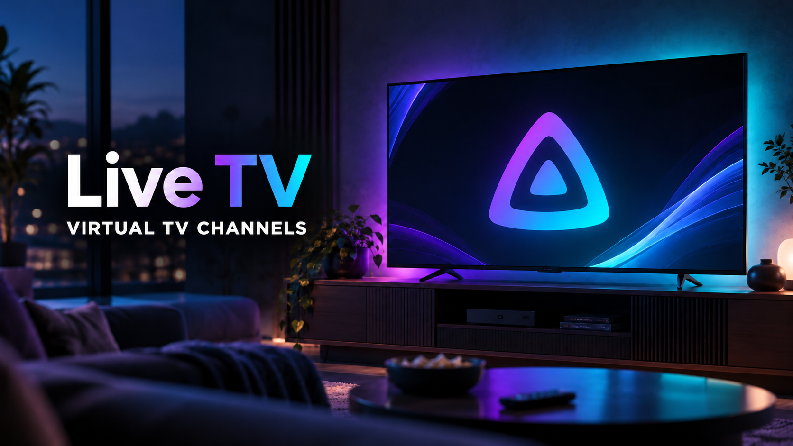

  

# Virtual TV for Jellyfin

**Turn your Jellyfin library into your own television network.**

Virtual TV is a Jellyfin plugin that turns the movies and TV shows you already have in your libraries into custom TV-style channels.

Instead of always choosing a movie or episode manually, you can create channels with their own schedules and content rules, then watch them through Jellyfin's normal Live TV experience.

📘 **Need help creating or configuring channels?** Read the **[Virtual TV User Guide](USER_GUIDE.md)** for a detailed explanation of every setting, playback mode and common configuration combination.

## Why I created it

I created Virtual TV because I could not find an existing solution that worked exactly the way I wanted.

There are already several great pseudo-TV and linear-TV tools, but I wanted something integrated directly into Jellyfin that gave me control over which content belongs to each channel, how that content is scheduled, and how the channel should behave for each user.

I wanted the convenience and surprise of traditional television, while still taking advantage of Jellyfin features such as watched status and resume progress.

## How it was created

I am not a programmer and had no previous experience developing Jellyfin plugins.

Virtual TV was created with the help of **ChatGPT**. I defined how I wanted the plugin to work, tested each version on my own Jellyfin server and devices, reported problems, and refined the behaviour step by step.

ChatGPT was used to help design and write the code, while the features and workflow were shaped around real-world use and testing.

## How it works

Virtual TV creates Live TV channels using media that is already available in your Jellyfin libraries.

You choose the movies, series or seasons that belong to a channel and decide how the content should be selected. Virtual TV then builds a schedule and exposes the channel through Jellyfin's normal Live TV Guide.

There are two main viewing styles:

- **Standard TV** — behaves like a traditional television channel. You join the programme at the point where it is currently scheduled and watch it as a live broadcast. There is no normal VOD backtracking, fast-forward seeking, resume point or selectable subtitle control while you are watching the live channel. When an eligible English subtitle track exists, Virtual TV may burn those subtitles directly into the live picture. If you want to restart the programme from the beginning, the Jellyfin **Record** action is repurposed as **Play from Beginning** and opens the real library item from 00:00.
- **Personalized TV** — opens the selected episode or movie in Jellyfin's normal player. That means you keep the normal Jellyfin experience: pause and resume, seek forward or backward, choose audio and subtitle tracks, use watched/resume progress, and continue from partially watched content. Personalized modes can also use your Jellyfin user history to choose what to play, including Next Unwatched and Random Unwatched behaviour.

### Client compatibility note

Virtual TV's client-side handoff features are currently tested primarily with **Jellyfin Web in a browser** and web-based clients such as **Jellyfin for webOS**. The webOS app is a lightweight wrapper around the Jellyfin Web interface provided by the server, so its playback behaviour is generally closer to the browser than to fully native TV clients.

With the native **Jellyfin Android TV** client, **Personalized TV remains unsupported** because its Live TV → normal library-item handoff does not behave like Jellyfin Web. **Standard TV uses Jellyfin's normal Live TV path and is supported by the current Virtual TV architecture.**

The Standard TV **Record → Play from Beginning** shortcut is client-dependent. It works through Jellyfin's Record action without creating a real recording, but native Android TV uses its own DVR/session flow and this shortcut is **not considered fully validated on Android TV in v1.0.0**. Standard TV live playback itself remains the supported Android TV path.

On **Jellyfin for Android** phones and tablets, Virtual TV 1.0.0 keeps the normal Loading → VOD flow but routes the selected episode/movie through the app's companion WebView control session. This makes the handoff follow Jellyfin's normal local `playbackManager.play()` path used when Play is pressed on an episode. Physical EOF returns to Virtual TV Loading before the next programme is resolved; for this Virtual TV flow, **Play next episode automatically should remain disabled** for the user.

Personalized channels can also be configured with **Hide from Android TV**. Virtual TV 1.0.0 recognizes both legacy `Jellyfin Android TV` and current `Jellyfin for Android TV` client names (including debug suffixes), covering Android TV, Google TV and Fire TV devices using that client. Hidden channels are filtered from Android TV Live TV channel/program responses while remaining visible on Web, webOS and Android phones/tablets.

Jellyfin Web/browser and web-based clients such as Jellyfin for webOS remain the primary reference clients for **Personalized TV**.

Your original media remains in Jellyfin; Virtual TV simply creates another way to watch it.

## Main features

- Create custom TV channels from Jellyfin movies and TV shows
- Choose specific series, seasons or groups of content
- Standard TV-style scheduled playback
- Per-channel Standard TV quality: **480p, 720p or 1080p**
- **Clone Channel** to create a new pre-filled channel from an existing configuration
- **Export / Import Channel Configuration** to back up a channel's editable settings and re-populate them later in Create/Edit without copying artwork or schedules
- Optional **Hide from Android TV** for Personalized channels
- Improved Personalized TV handoff on Android phones/tablets
- Personalized channels based on the Jellyfin user
- Sequential, Random and weighted **True Random** playback
- **Next Unwatched** and **Random Unwatched** modes
- Resume-first behaviour for unfinished content
- Optional support for Specials
- Movie-only or series-only channels
- Flexible scheduling and programme blocks
- Per-user channel visibility
- Content Coverage tools to identify assigned and unassigned media
- Integration with Jellyfin's existing Live TV Guide
- Start the current Standard TV programme from the beginning in the normal Jellyfin player

## Current release

The current release is **Virtual TV v1.0.0**, the **first official public full release**, developed and validated for **Jellyfin 12.1**.

Jellyfin displays the installed technical assembly/package version as **1.0.0.0**. This is the same v1.0.0 release; the four-part value is used so Jellyfin can match the installed plugin back to its repository entry correctly.

This v1.0.0 release promotes the final validated test build without changing its playback or scheduling implementation. The public repository intentionally exposes **v1.0.0 as the only official release available for installation**.

Virtual TV is still a personal project and will continue to evolve as new ideas, improvements and issues are found through everyday use.

## Installation

### Recommended — install directly from Jellyfin

The easiest way to install Virtual TV is through Jellyfin's Plugin Catalog.

1. Open **Dashboard → Plugins → Repositories**.
2. Add a new repository:
   - **Repository Name:** `R-BCK-gitgub / Virtual TV`
   - **Repository URL:** `https://raw.githubusercontent.com/R-BCK-gitgub/jellyfin-plugin-virtualtv/main/manifest.json`
3. Save the repository.
4. Open **Dashboard → Plugins → Catalog**.
5. Find **Virtual TV** and select **Install**.
6. Restart Jellyfin when prompted.

After the restart, open **Dashboard → Plugins → My Plugins → Virtual TV** and confirm that the plugin is active.

Using the repository is recommended because future compatible releases can be offered through Jellyfin's normal plugin update system.

### Manual installation

If you prefer to install the plugin manually:

1. Download the latest ZIP from the **Releases** section.
2. Stop Jellyfin.
3. Create a folder named `VirtualTV` inside your Jellyfin plugins directory.
4. Extract the files from the ZIP directly into that `VirtualTV` folder.
5. Start Jellyfin again.
6. Open **Dashboard → Plugins → My Plugins → Virtual TV** and confirm that the plugin is active.

The exact plugins directory depends on how your Jellyfin server is installed.

## Jellyfin repository metadata

Repository name:

`R-BCK-gitgub / Virtual TV`

Repository URL:

`https://raw.githubusercontent.com/R-BCK-gitgub/jellyfin-plugin-virtualtv/main/manifest.json`

The repository catalog allows Jellyfin to identify the plugin, developer and repository information correctly.

## Feedback

Feedback, suggestions and bug reports are welcome.

If you find an issue or have an idea that could improve Virtual TV, feel free to open an issue on GitHub.

---

*Virtual TV is an independent personal project and is not affiliated with or endorsed by Jellyfin.*
